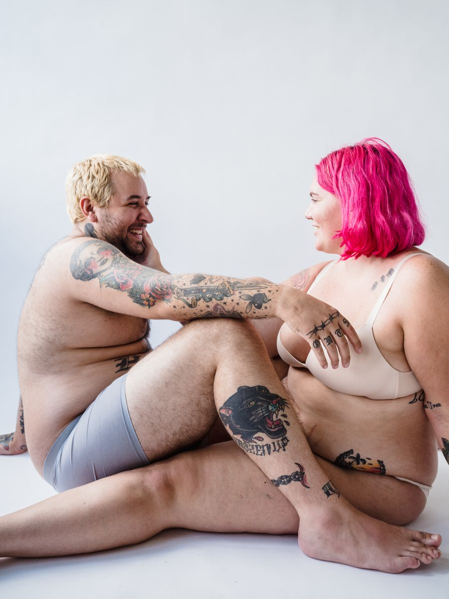

# Luanzzo Fitness — site

Site de uma página só, estático (HTML/CSS/JS puro). Não precisa de servidor,
banco de dados nem instalação: é só abrir o `index.html`.

## Antes de colocar no ar — 3 coisas obrigatórias

### 1. Número do WhatsApp
Abra `script.js`, primeira linha de código:

```js
const WHATSAPP = '5511999999999';   // ← troque aqui
```

Formato: `55` + DDD + número, só dígitos.
Ex.: (31) 98765-4321 → `5531987654321`

Isso já atualiza **todos** os botões do site (topo, kits, CTA e o botão flutuante),
cada um com uma mensagem pronta diferente.

### 2. Fotos
As fotos em `img/` **já são reais**, baixadas do Pexels (uso comercial liberado).
Fonte de cada uma em [CREDITOS.md](CREDITOS.md). Elas funcionam pra colocar o site
no ar hoje, mas são modelos genéricos — troque pelas fotos do seu produto assim que
tiver. Mantendo o mesmo nome de arquivo, nada mais precisa ser mexido.

| Arquivo | Onde aparece | Proporção |
|---|---|---|
| `hero-1/2/3.jpg` | carrossel do topo | 3:4 (900×1200) |
| `produto-1/2/3.jpg` | cards dos kits | 4:3 (800×600) |
| `galeria-1..4.jpg` | grade de cores | 3:4 (600×800) |
| `tecido.jpg` | seção do tecido | 1:1 (800×800) |
| `avatar-1..4.svg` | avatares dos depoimentos | quadrada |

**Carrossel do topo:** troca de foto sozinho a cada 5 segundos e pausa quando o
mouse está em cima. Tem setas, bolinhas e arrasta com o dedo no celular.
Para colocar uma quarta foto, salve como `img/hero-4.jpg` e acrescente a linha
no `index.html`, dentro de `<div class="carrossel">`:

```html

```

As bolinhas se ajustam sozinhas — não precisa mexer em mais nada. Para mudar a
velocidade, troque o `5000` (milissegundos) em `script.js`, na linha `const INTERVALO`.

Se for buscar outras no Pexels/Unsplash, **confira o cós antes**: muita foto de
banco tem marca de concorrente legível no elástico (foi por isso que descartei três).

*Quer gerar com IA?* Prompt pronto:

> Studio photo of a fit male model from the neck down, wearing plain black boxer
> briefs, dark charcoal seamless background, dramatic side lighting, athletic build,
> full body, vertical 3:4 framing, commercial underwear advertising photography,
> photorealistic, high detail

Para os cards dos kits, troque o final por `close-up on waistband, horizontal 4:3 framing`.
Para as outras cores, troque `black` por `navy blue`, `dark grey`, `white`.

### 3. Depoimentos
⚠️ Os 4 depoimentos são **fictícios**, só de exemplo (nomes, cidades e textos inventados).
Troque por avaliações reais de clientes antes de publicar — inclusive os números
"+8.400 clientes", "4,9 ★ / 1.203 avaliações" no topo e na seção de depoimentos.
O mesmo vale para o CNPJ no rodapé.

Os avatares continuam sendo ícones neutros de propósito: as pessoas das fotos do
Pexels não são suas clientes, então não dá pra usar a cara delas assinando
depoimento.

## Também dá pra ajustar fácil

- **Preços e nomes dos kits** → `index.html`, seção `id="produtos"`.
- **Cores da marca** → `styles.css`, bloco `:root` no topo (`--lima` é a cor de destaque).
- **Perguntas do FAQ** → `index.html`, seção `id="faq"`.
- **Instagram / e-mail** → rodapé do `index.html`.

## Como publicar (grátis)

1. **Netlify Drop** — netlify.com/drop: arrasta a pasta inteira na página, sai com link no ar.
2. **Vercel** — vercel.com, mesma ideia.
3. **GitHub Pages** — sobe a pasta num repositório e ativa Pages nas configurações.

Depois é só apontar o domínio (ex. `luanzzofitness.com.br`) para o serviço escolhido.
